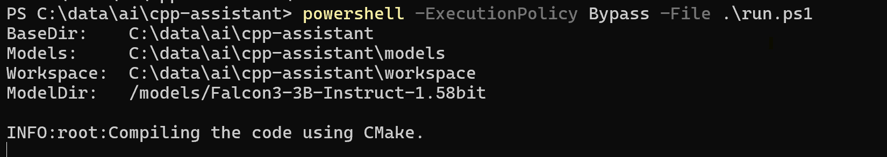

# C++ Coding Assistant

Experimental repository for self-study to evaluate possibilities to
- run bitnet 1.58-xxx in a podman container
- connect native (windows) VS Code to the container
- provide C++ coding assistance
- after installation & setup offline available (not data to be shared outside!!!)

## Prerequesites
* [x] WSL2 installed (will be used by podman to allow linux pods)
* [x] Python 3.14 installed
* [x] podman / podman desktop installed (should also work with docker!)
* [x] podman-compose installed (python tool)


## High Level Steps

1. Download model from huggingface (see): download-model.ps1
```powershell
powershell -ExecutionPolicy Bypass -File .\download-model.ps1
```
2. Container build:
```powershell
   powershell -ExecutionPolicy Bypass -File .\build.ps1
``` 
3. Container start:
```powershell
   powershell -ExecutionPolicy Bypass -File .\run.ps1
``` 



## Progress
* [x] download model
* [x] build container 
* [x] run container
* [-] connect to local VS Code


## VS Code

Install continue extension (.vsix offline possible...)
copy config.yaml  ~/.continue/ 
Windows: copy config.yaml %USERPROFILE%

